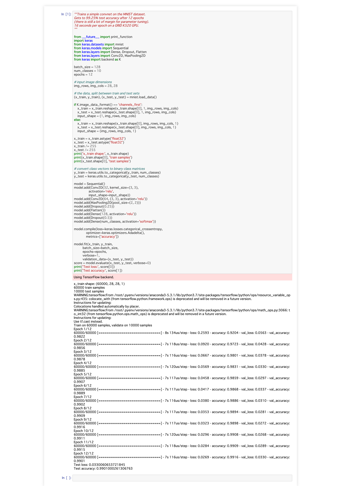

# study_of_deeplearning_with_keras
## How to Build Docker image
### (1) Download cuDNN from [cuDNN Archive](https://developer.nvidia.com/rdp/cudnn-archive#a-collapse714-9)
* libcudnn7_7.6.2.24-1+cuda10.0_amd64.deb
* libcudnn7-dev_7.6.2.24-1+cuda10.0_amd64.deb
* libcudnn7-doc_7.6.2.24-1+cuda10.0_amd64.deb
### (2) Store above files into "download" directory
```
$ cd build/download/
$ ls -l
total 314384
-rw-r--r-- 1 ttsubo ttsubo 164426244 Sep 29 14:36 libcudnn7_7.6.2.24-1+cuda10.0_amd64.deb
-rw-r--r-- 1 ttsubo ttsubo 152045132 Sep 29 14:36 libcudnn7-dev_7.6.2.24-1+cuda10.0_amd64.deb
-rw-r--r-- 1 ttsubo ttsubo   5442884 Sep 29 14:36 libcudnn7-doc_7.6.2.24-1+cuda10.0_amd64.deb
```
### (3) Build docker image
```
$ docker-compose build
```

## How to Run sample code provided by keras repo
https://github.com/keras-team/keras/blob/master/examples/mnist_cnn.py
### (1) Start Docker container
```
$ docker-compose up
Creating Keras ... done
Attaching to Keras
Keras           | [I 05:43:15.263 NotebookApp] Writing notebook server cookie secret to /root/.local/share/jupyter/runtime/notebook_cookie_secret
Keras           | [W 05:43:15.379 NotebookApp] All authentication is disabled.  Anyone who can connect to this server will be able to run code.
Keras           | [I 05:43:15.403 NotebookApp] JupyterLab extension loaded from /root/.pyenv/versions/anaconda3-5.3.1/lib/python3.7/site-packages/jupyterlab
Keras           | [I 05:43:15.404 NotebookApp] JupyterLab application directory is /root/.pyenv/versions/anaconda3-5.3.1/share/jupyter/lab
Keras           | [I 05:43:15.406 NotebookApp] Serving notebooks from local directory: /root
Keras           | [I 05:43:15.406 NotebookApp] The Jupyter Notebook is running at:
Keras           | [I 05:43:15.406 NotebookApp] http://(Keras or 127.0.0.1):8888/
Keras           | [I 05:43:15.406 NotebookApp] Use Control-C to stop this server and shut down all kernels (twice to skip confirmation).
Keras           | [W 05:43:15.407 NotebookApp] No web browser found: could not locate runnable browser.
```
### (2) Enter in a docker container
```
$ docker exec -it Keras bash
```
### (3) Execute sample code
```
root@Keras:~# python examples/mnist_cnn.py
Using TensorFlow backend.
x_train shape: (60000, 28, 28, 1)
60000 train samples
10000 test samples
WARNING:tensorflow:From /root/.pyenv/versions/anaconda3-5.3.1/lib/python3.7/site-packages/tensorflow/python/ops/resource_variable_ops.py:435: colocate_with (from tensorflow.python.framework.ops) is deprecated and will be removed in a future version.
Instructions for updating:
Colocations handled automatically by placer.
WARNING:tensorflow:From /root/.pyenv/versions/anaconda3-5.3.1/lib/python3.7/site-packages/tensorflow/python/ops/math_ops.py:3066: to_int32 (from tensorflow.python.ops.math_ops) is deprecated and will be removed in a future version.
Instructions for updating:
Use tf.cast instead.
2019-09-29 06:00:42.812063: I tensorflow/core/platform/cpu_feature_guard.cc:141] Your CPU supports instructions that this TensorFlow binary was not compiled to use: AVX2 FMA
2019-09-29 06:00:42.836021: I tensorflow/core/platform/profile_utils/cpu_utils.cc:94] CPU Frequency: 3696000000 Hz
2019-09-29 06:00:42.837164: I tensorflow/compiler/xla/service/service.cc:150] XLA service 0x55b835097c10 executing computations on platform Host. Devices:
2019-09-29 06:00:42.837179: I tensorflow/compiler/xla/service/service.cc:158]   StreamExecutor device (0): <undefined>, <undefined>
2019-09-29 06:00:42.892850: I tensorflow/stream_executor/cuda/cuda_gpu_executor.cc:998] successful NUMA node read from SysFS had negative value (-1), but there must be at least one NUMA node, so returning NUMA node zero
2019-09-29 06:00:42.893259: I tensorflow/compiler/xla/service/service.cc:150] XLA service 0x55b834b7c9b0 executing computations on platform CUDA. Devices:
2019-09-29 06:00:42.893288: I tensorflow/compiler/xla/service/service.cc:158]   StreamExecutor device (0): GeForce GTX 1060 3GB, Compute Capability 6.1
2019-09-29 06:00:42.893421: I tensorflow/core/common_runtime/gpu/gpu_device.cc:1433] Found device 0 with properties:
name: GeForce GTX 1060 3GB major: 6 minor: 1 memoryClockRate(GHz): 1.7085
pciBusID: 0000:01:00.0
totalMemory: 2.95GiB freeMemory: 2.88GiB
2019-09-29 06:00:42.893445: I tensorflow/core/common_runtime/gpu/gpu_device.cc:1512] Adding visible gpu devices: 0
2019-09-29 06:00:42.893868: I tensorflow/core/common_runtime/gpu/gpu_device.cc:984] Device interconnect StreamExecutor with strength 1 edge matrix:
2019-09-29 06:00:42.893877: I tensorflow/core/common_runtime/gpu/gpu_device.cc:990]      0
2019-09-29 06:00:42.893883: I tensorflow/core/common_runtime/gpu/gpu_device.cc:1003] 0:   N
2019-09-29 06:00:42.893984: I tensorflow/core/common_runtime/gpu/gpu_device.cc:1115] Created TensorFlow device (/job:localhost/replica:0/task:0/device:GPU:0 with 2647 MB memory) -> physical GPU (device: 0, name: GeForce GTX 1060 3GB, pci bus id: 0000:01:00.0, compute capability: 6.1)
Train on 60000 samples, validate on 10000 samples
Epoch 1/12
2019-09-29 06:00:43.489125: I tensorflow/stream_executor/dso_loader.cc:152] successfully opened CUDA library libcublas.so.10.0 locally
60000/60000 [==============================] - 8s 127us/step - loss: 0.2654 - accuracy: 0.9186 - val_loss: 0.0628 - val_accuracy: 0.9785
Epoch 2/12
60000/60000 [==============================] - 7s 115us/step - loss: 0.0888 - accuracy: 0.9736 - val_loss: 0.0430 - val_accuracy: 0.9849
Epoch 3/12
60000/60000 [==============================] - 7s 112us/step - loss: 0.0677 - accuracy: 0.9802 - val_loss: 0.0394 - val_accuracy: 0.9871
Epoch 4/12
60000/60000 [==============================] - 7s 114us/step - loss: 0.0566 - accuracy: 0.9832 - val_loss: 0.0321 - val_accuracy: 0.9885
Epoch 5/12
60000/60000 [==============================] - 7s 114us/step - loss: 0.0480 - accuracy: 0.9860 - val_loss: 0.0350 - val_accuracy: 0.9882
Epoch 6/12
60000/60000 [==============================] - 7s 110us/step - loss: 0.0450 - accuracy: 0.9864 - val_loss: 0.0274 - val_accuracy: 0.9897
Epoch 7/12
60000/60000 [==============================] - 7s 113us/step - loss: 0.0395 - accuracy: 0.9883 - val_loss: 0.0292 - val_accuracy: 0.9903
Epoch 8/12
60000/60000 [==============================] - 7s 114us/step - loss: 0.0351 - accuracy: 0.9890 - val_loss: 0.0309 - val_accuracy: 0.9893
Epoch 9/12
60000/60000 [==============================] - 7s 112us/step - loss: 0.0342 - accuracy: 0.9892 - val_loss: 0.0288 - val_accuracy: 0.9906
Epoch 10/12
60000/60000 [==============================] - 7s 111us/step - loss: 0.0328 - accuracy: 0.9900 - val_loss: 0.0264 - val_accuracy: 0.9918
Epoch 11/12
60000/60000 [==============================] - 7s 112us/step - loss: 0.0305 - accuracy: 0.9901 - val_loss: 0.0280 - val_accuracy: 0.9916
Epoch 12/12
60000/60000 [==============================] - 7s 117us/step - loss: 0.0289 - accuracy: 0.9911 - val_loss: 0.0268 - val_accuracy: 0.9917
Test loss: 0.026753987711756782
Test accuracy: 0.9916999936103821
root@Keras:~/examples#
```
## How to Run sample code via jupyter notebook
You can use jupyter notebook by connecting docker-container using web browser

